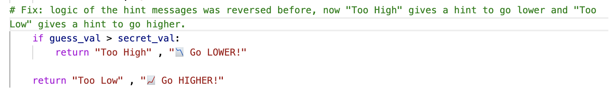
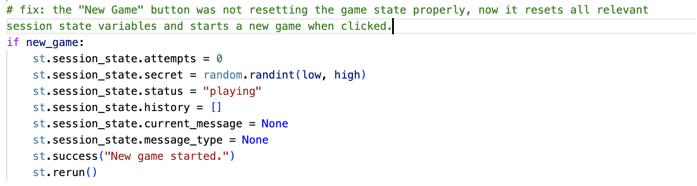
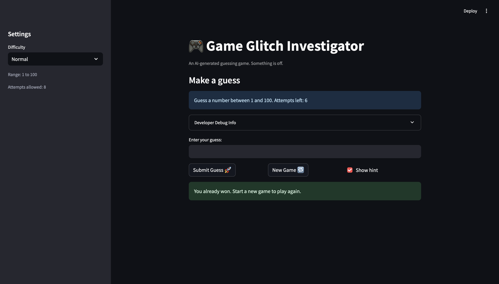

# 🎮 Game Glitch Investigator: The Impossible Guesser

## 🚨 The Situation

You asked an AI to build a simple "Number Guessing Game" using Streamlit.
It wrote the code, ran away, and now the game is unplayable.

- You can't win.
- The hints lie to you.
- The secret number seems to have commitment issues.

## 🛠️ Setup

1. Install dependencies: `pip install -r requirements.txt`
2. Run the broken app: `python -m streamlit run app.py`

## 🕵️‍♂️ Your Mission

1. **Play the game.** Open the "Developer Debug Info" tab in the app to see the secret number. Try to win.
2. **Find the State Bug.** Why does the secret number change every time you click "Submit"? Ask ChatGPT: *"How do I keep a variable from resetting in Streamlit when I click a button?"*
3. **Fix the Logic.** The hints ("Higher/Lower") are wrong. Fix them.
4. **Refactor & Test.** - Move the logic into `logic_utils.py`.
   - Run `pytest` in your terminal.
   - Keep fixing until all tests pass!

## 📝 Document Your Experience

- [ ] The game's purpose is to find the bugs that make the game unplayable.
- [ ] I found some bugs in game hint logic (when the user put in lower number than secret number, the hint tells them to go lower and vice versa) and the "new game" button didn't work (when the user click on the new game button to start new game, it didn't work.)
- [ ] I asked copilot to fix the code for me about the hint backward and new game button. I changed the code in function check_guess in a logic_utils.py file to correct the hint backward issues and ask copilot to generate code in app.py to correct the issue with the not working "new game" button.

## 📸 Demo

